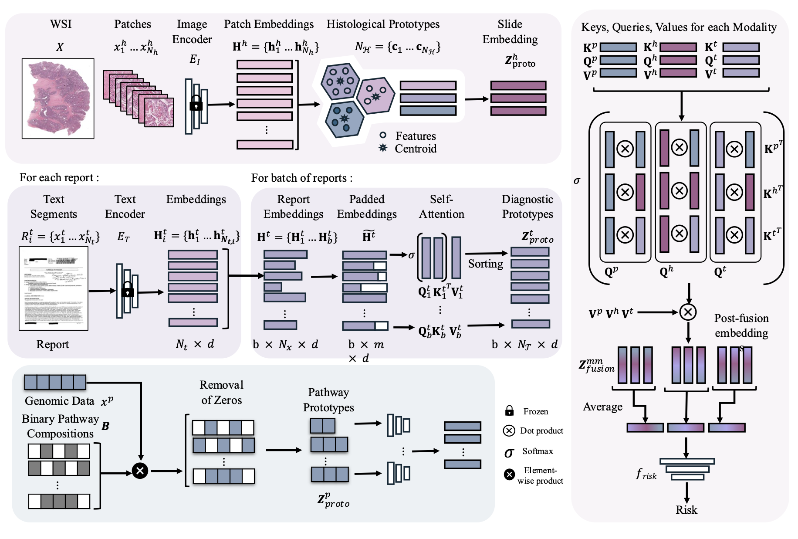

# PS3
PS3: A Multimodal Transformer Integrating Pathology Reports with Histology Images and Biological Pathways for Cancer Survival Prediction

**Abstract**: Current multimodal fusion approaches in computational oncology primarily focus on integrating multi-gigapixel histology whole slide images (WSIs) with genomic or transcriptomic data, demonstrating improved survival prediction. We hypothesize that incorporating pathology reports can further enhance prognostic performance. Pathology reports, as essential components of clinical workflows, offer readily available complementary information by summarizing histopathological findings and integrating expert interpretations and clinical context. However, fusing these modalities poses challenges due to their heterogeneous nature. WSIs are high-dimensional, each containing several billion pixels, whereas pathology reports consist of concise text summaries of varying lengths, leading to potential modality imbalance. 

To address this, we propose a prototype-based approach to generate balanced representations, which are then integrated using a Transformer-based fusion model for survival prediction that we term PS3 (Predicting Survival from Three Modalities). Specifically, we present: 
(1) Diagnostic prototypes from pathology reports, leveraging self-attention to extract diagnostically relevant sections and standardize text representation; 
(2) Histological prototypes to compactly represent key morphological patterns in WSIs; and 
(3) Biological pathway prototypes to encode transcriptomic expressions, accurately capturing cellular functions. 

PS3, the three-modal transformer model, processes the resulting prototype-based multimodal tokens and models intra-modal and cross-modal interactions across pathology reports, WSIs and transcriptomic data. The proposed model outperforms state-of-the-art methods when evaluated against clinical, unimodal and multimodal baselines on six datasets from The Cancer Genome Atlas (TCGA). 

Accepted at **ICCV 2025**.

[Paper on arXiv](https://arxiv.org/abs/2509.20022) | [PDF](https://arxiv.org/pdf/2509.20022)



## Installation

After cloning the repository, install the required dependencies:

```bash
pip install -r requirements.txt
```

## Dataset Organization

### Data splits

The train/test split CSV files for 5-fold cross-validation are provided under:

```text
src/PS3_Splits/
```

Each cancer type has its own folder containing the corresponding train and test split files.

### Histology prototypes

For this code, we assume that WSI patch features have already been extracted. Each WSI should be represented as a set of patch-level features. The code expects WSI patch features in `.pt` format.

For examples of WSI patch feature extraction, please refer to [CLAM](https://github.com/mahmoodlab/CLAM) and [TRIDENT](https://github.com/mahmoodlab/TRIDENT).

During survival training, if `--model_histo_type` is set to a prototype-based model such as `PANTHER`, `OT`, `H2T`, or `ProtoCount`, the training pipeline prepares slide-level prototype embeddings from the extracted WSI patch features. Precomputed prototypes can also be generated separately using:

```bash
python src/training/main_prototype.py
```

The generated prototypes are saved under:

```text
<split_dir>/prototypes/
```

A concrete example script using TCGA-BLCA patch features is provided at:

```text
src/scripts/prototype/blca.sh
```


### Pathway prototypes

PS3 uses pan-cancer normalized TCGA transcriptomics expression data from the UCSC Xena database. The processed pathway-level files are stored under:

```text
src/data_csvs/rna/hallmarks/
```

Using the Hallmark gene sets located at:

```text
src/data_csvs/rna/metadata/hallmarks_signatures.csv
```

we filter genes that belong to Hallmark pathways and construct pathway-level transcriptomic representations.

### Text prototypes

For this code, we assume that pathology report features have already been extracted.

Machine-readable TCGA pathology reports can be obtained from [TCGA Pathology Reports](https://github.com/tatonetti-lab/tcga-path-reports).

Report features can be extracted using:

```text
src/training/generate_text_embeddings.py
```

The `text_target_length` argument can be used to adjust the number of text prototypes selected from each pathology report.


## Training and Evaluation

The main entry point for survival prediction is:

```text
src/training/main_survival.py
```

This script trains or evaluates PS3 using the prepared WSI patch features, pathology report features, transcriptomic pathway features, and train/test split files.

Example command:

```bash
python src/training/main_survival.py \
  --data_source /path/to/WSI_patch_features \
  --reports_dir /path/to/report_features \
  --split_dir PS3_Splits/tcga-blca/TCGA_BLCA_overall_survival_k=0 \
  --omics_dir src/data_csvs/rna \
  --results_dir /path/to/save/results \
  --task BLCA_survival \
  --model_histo_type PANTHER \
  --model_mm_type coattn_text \
  --attn_mode full_all_es \
  --text_resizing_model SA_sampling
```

For the proposed PS3 model, use:

```bash
--model_histo_type PANTHER
--model_mm_type coattn_text
--attn_mode full_all_es
--text_resizing_model SA_sampling
```

During training, the script automatically computes the number of text prototypes from the training pathology report embeddings. For the proposed PS3 model, `PANTHER` is used as the prototype-based histology model to prepare slide-level prototype embeddings from the extracted WSI patch features.

The trained model checkpoints, configuration file, result files, and `summary.csv` are saved under `--results_dir`.


## Citation

If you find our work useful in your research, or if you use parts of this code, please cite our paper:

```bibtex
@inproceedings{raza2025ps3,
  title={PS3: A Multimodal Transformer Integrating Pathology Reports with Histology Images and Biological Pathways for Cancer Survival Prediction},
  author={Raza, Manahil and Azam, Ayesha and Qaiser, Talha and Rajpoot, Nasir},
  booktitle={Proceedings of the IEEE/CVF International Conference on Computer Vision},
  pages={22175--22186},
  year={2025}
}
```

## Acknowledgements

Parts of this codebase were adapted from or inspired by the following repositories: [MMP](https://github.com/mahmoodlab/MMP), [PANTHER](https://github.com/mahmoodlab/PANTHER), and [SurvPath](https://github.com/mahmoodlab/SurvPath).

We thank the authors of these repositories for making their code publicly available.


